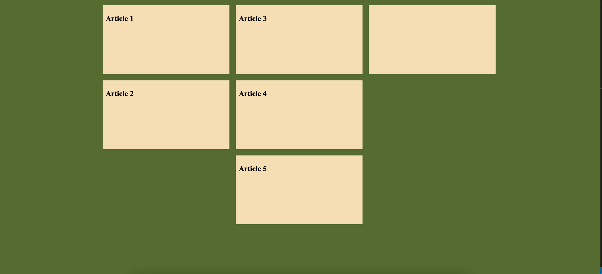
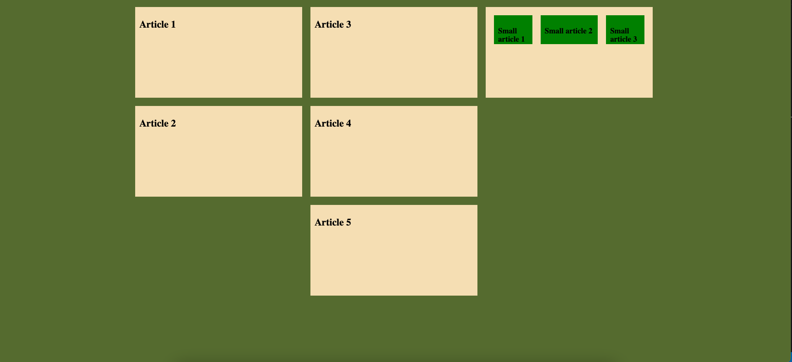

#CSS Flexbox opdracht 2

##Opdracht 1

Maak onderstaande afbeelding na mbv flexbox. Gebruik o.a. een 'flex-direction' met waarde 'column'. Zorg er voor dat de breedte van de
cellen 20 procent van de schermbreedte worden en de hoogte 200 pixels. Het geheel dient horizontaal gecentreerd te worden.

##Opdracht 2

Voeg aan de rechter cel drie kleinere cellen toe van 50 pixels breed en 50 pixels hoog. Zorg er voor dat de twee buitenste kleine cellen drie
keer zo snel groeien als de middelste cel. Dit kun je met de 'flex-grow' property instellen. Door je browser venster in breedte te veranderen
kun je testen of de middelste kleine cel groter wordt dan de buitenste cellen.

